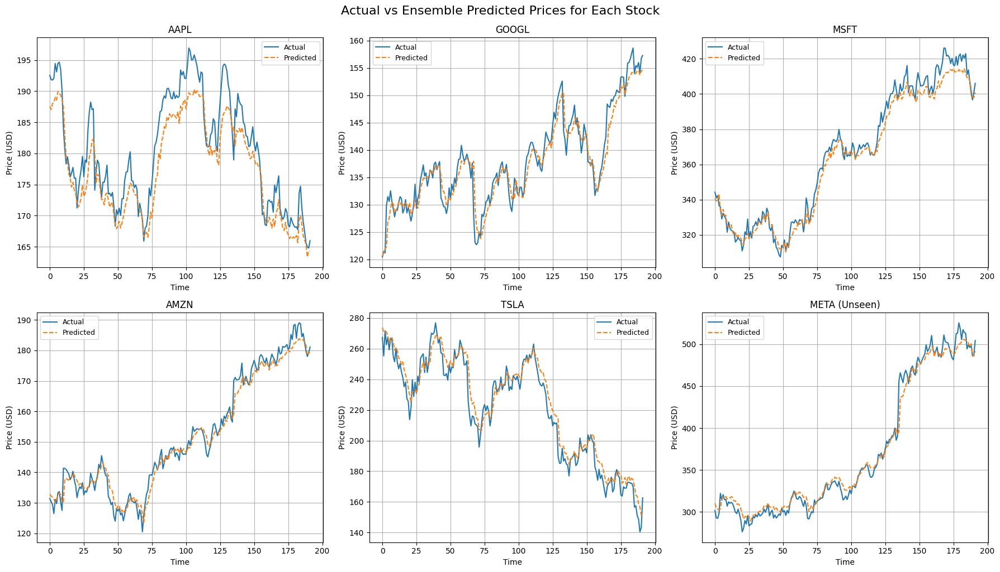

# RealStockSync 🚀📈  
**Real-time Stock Prediction using Ensemble Learning and Sentiment Analysis**

RealStockSync is a real-time, end-to-end stock price prediction pipeline that combines financial market data and Twitter sentiment using ensemble learning models (LightGBM + LSTM). The system performs streaming data ingestion, feature engineering, model inference, and dashboard visualization to forecast stock movements.

---

## 🌟 Features

- 🔁 Real-time data ingestion using **Yahoo Finance API** and **Twitter API**
- 📦 Stream processing with **Apache Kafka** and **Spark Streaming**
- 🧠 Ensemble model combining **LightGBM** and **LSTM**
- 📊 Sentiment analysis using **TextBlob**
- 🧮 Feature engineering (EMA, RSI, MACD, PCA, etc.)
- 📁 Data storage in **MongoDB**
- 📉 Dashboard visualization with **Dash (Plotly)** and **Tableau**
- 🧪 Evaluation metrics: R², RMSE, MAE, Directional Accuracy
- 🔔 Anomaly detection and alerting on prediction deviations

---

## 📂 Project Architecture

---

## 🛠️ Tech Stack

- Python, Pandas, NumPy
- Apache Kafka, Spark Streaming
- MongoDB
- LightGBM, LSTM (Keras/TensorFlow)
- Dash (Plotly), Tableau
- Yahoo Finance API

---

## 📊 Model Performance (Ensemble)

| Stock | R² Score | RMSE  | MAE   |
|-------|----------|-------|--------|
| AAPL  | 0.8074   | 0.0345 | 0.0296 |
| GOOGL | 0.9275   | 0.0251 | 0.0188 |
| MSFT  | 0.9794   | 0.0224 | 0.0178 |
| AMZN  | 0.9788   | 0.0261 | 0.0200 |
| TSLA  | 0.9528   | 0.0212 | 0.0166 |
| META* | 0.9866   | 0.0214 | 0.0154 |

> *META is an unseen stock in training, showing strong generalization.*

---
## 🖥️ Hardware Requirements

- RAM: 16 GB
- GPU: NVIDIA RTX 3050 (CUDA-enabled)
- OS: Windows/Linux/macOS (Docker optional for deployment)

---

## 📈 Sample Visualization

The above visualization compares the ensemble model’s predictions with actual closing prices for multiple stocks. This plot demonstrates how closely the model tracks real stock market behavior, offering a quick visual assessment of prediction accuracy across time.

---

## 🔮 Future Enhancements

### Model Improvements

- Integrate more advanced deep learning architectures like **Temporal Fusion Transformers (TFT)** or **Informer** for improved sequence modeling.
- Incorporate **cross-stock learning** by introducing relational features across correlated stocks.
- Improve the ensemble strategy by introducing **meta-learners** to dynamically weight predictions from base models.

### Drift Detection, Scheduling, API Deployment, etc.

- Implement **concept drift detection** using statistical monitoring to identify shifts in data distribution and trigger model retraining.
- Add a **task scheduler (like Airflow or Prefect)** to automate end-to-end data ingestion, processing, and model inference pipelines.
- Deploy models using **FastAPI** or **Flask** for serving predictions via REST APIs.
- Include **logging and monitoring tools** (e.g., Prometheus, Grafana) for production-grade observability.
- Expand visualization to include interactive forecasting dashboards with **real-time updates** and historical backtesting.

---

## 🤝 Contributing

We welcome contributions from the community! Feel free to:

- Open issues for bug reports or enhancement requests
- Submit pull requests for new features or improvements
- Fork the repository and explore your own ideas

Please make sure to follow the existing coding style and include proper documentation in your contributions.

---

## 📄 License

This project is licensed under the MIT License. See the [LICENSE](LICENSE) file for details.

---

## 🙌 Acknowledgements

- [Yahoo Finance](https://finance.yahoo.com/) for financial data
- [LightGBM](https://lightgbm.readthedocs.io/) and [Keras](https://keras.io/) for machine learning
- [Apache Kafka](https://kafka.apache.org/) and [MongoDB](https://www.mongodb.com/) for streaming and storage
- [Plotly Dash](https://dash.plotly.com/) for the web dashboard

---

> Built with ❤️ by [Sahil Ahuja, Jai Sehgal, Gaurav Choudhary, Kapish Goel, Kshipra Malviya, Anal Singh]
